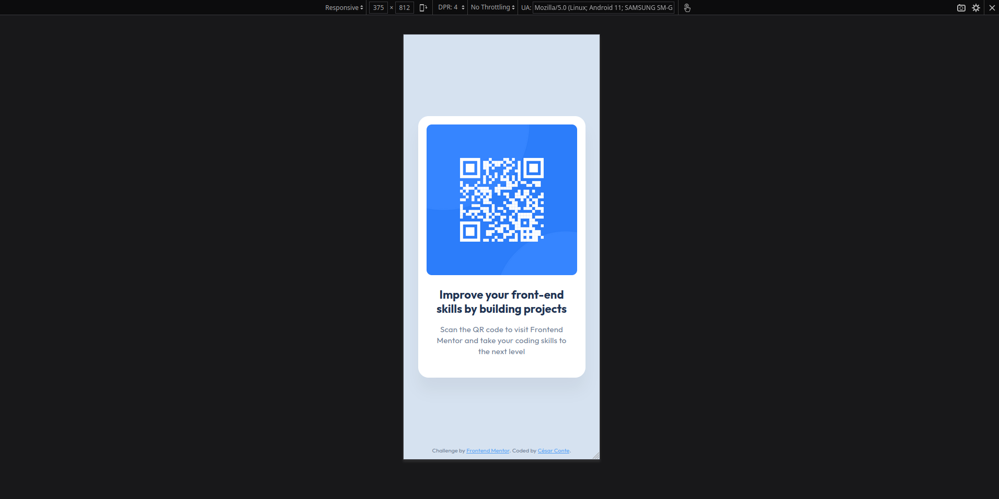

# QR Code Component

A Frontend Mentor challenge implementation focused on building a QR code component. This project demonstrates fundamental HTML and CSS skills through a practical example.

## Overview

This is a solution to the [QR code component challenge on Frontend Mentor](https://www.frontendmentor.io/challenges/qr-code-component-iux_sIO_H). Frontend Mentor challenges help improve coding skills by building realistic projects.

### Screenshot

### Links

- Live Site URL: [Add your live site URL here](https://qrcodecomponent-cc.netlify.app)
- Solution URL: [Add your solution URL here](https://github.com/cesarconte/qr-code-component-main.git)

## My process

### Built with

- Semantic HTML5 markup
- CSS custom properties (variables)
- Flexbox for layout and centering
- BEM naming convention

### What I learned

Through this project, I strengthened my understanding of:

- CSS Custom Properties for maintaining consistent variables
- BEM methodology for creating scalable CSS class naming
- Flexbox layout for centered positioning and component structure

Along with the implementation of Flexbox for layout, one of the main focuses was implementing a systematic approach using CSS Custom Properties. Here's how I structured the variables:

/_ Design tokens implementation _/
:root {
/_ Define color palette first _/
--slate-900: hsl(218, 44%, 22%);
--slate-500: hsl(216, 15%, 48%);
--slate-300: hsl(212, 45%, 89%);
--white: hsl(0, 0%, 100%);
--blue-500: hsl(212, 92%, 64%);

/_ Then define semantic usage _/
--text-primary: var(--slate-900);
--text-secondary: var(--slate-500);
--background: var(--slate-300);
--card-background: var(--white);
--link-color: var(--blue-500);
--shadow-color: hsla(0, 0%, 0%, 0.0476518);

/_ Shadow presets _/
--shadow: 0px 25px 25px 0px var(--shadow-color);

/_ Typograpy presets _/
--font-family: 'Outfit', sans-serif;
--text-preset-1: 700 22px/120% var(--font-family);
--text-preset-2: 400 15px/140% var(--font-family);
--text-preset-3: 400 11px/normal var(--font-family);
--letter-spacing-tight: 0px;
--letter-spacing-wide: 0.2px;

/_ Spacing scale _/
--spacing-500: 40px;
--spacing-300: 24px;
--spacing-200: 16px;

/_ Border radius scale _/
--border-radius-500: 20px;
--border-radius-300: 10px;
}
